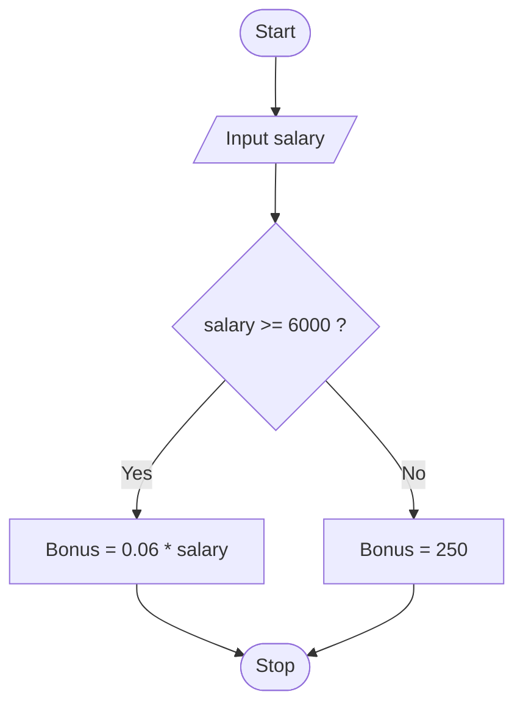

# Programming Fundamentals — course site

A [MkDocs](https://www.mkdocs.org/) + [Material](https://squidfunk.github.io/mkdocs-material/) site with runnable, in-browser Python cells (via [Pyodide](https://pyodide.org/)) and self-graded quizzes, both authored as plain Markdown fenced code blocks.

## Run it locally

```bash
python -m venv .venv
source .venv/bin/activate        # Windows: .venv\Scripts\activate
pip install -r requirements.txt
mkdocs serve
```

Open `http://127.0.0.1:8000`. Pages rebuild automatically as you edit.

## Put it on GitHub Pages

1. Create a GitHub repo and push this folder to it.
2. Update `repo_url` / `repo_name` at the top of `mkdocs.yml` to your repo's URL.
3. Either:
   - **Automatic** (recommended): the included `.github/workflows/deploy.yml` builds and publishes to the `gh-pages` branch on every push to `main`. After the first push, go to **Settings → Pages** and set the source to the `gh-pages` branch.
   - **Manual**: run `mkdocs gh-deploy` from your machine whenever you want to publish.

Your site will be live at `https://YOUR-USERNAME.github.io/YOUR-REPO/`.

## Adding a new lesson page

1. Create a Markdown file, e.g. `docs/module-2/01-conditionals.md`.
2. Add it to the `nav:` list in `mkdocs.yml`.
3. Write normal Markdown — headings, lists, tables, `!!! note` admonitions — plus the two custom blocks below wherever you want interactivity.

### A runnable Python cell

````markdown
```runpy
title: My cell title
sub: optional subtitle shown in italics
inputs:                     # optional — omit entirely for a cell with no input()
  - 12
  - 8
input_hint: a, then b       # optional hint text above the Inputs box
packages: [pandas]          # optional — Pyodide packages to load first
guard: false                # optional — turn off the infinite-loop guard
solution: |                 # optional — adds a "Show one answer" button
  perimeter = 2 * (length + width)
---
# everything below the --- line is the actual Python code
a = float(input("a: "))
print(a)
```
````

The Inputs box feeds those lines to `input()` in order, one call per line. Leave out `inputs:` entirely for a cell that doesn't call `input()`. There's a built-in guard against infinite loops (it stops any cell after ~400,000 traced lines with a friendly message), so it's safe to let students break things.

**`packages:`** loads Pyodide libraries before the code runs — `pandas`, `numpy`, `matplotlib` and [the rest of the Pyodide catalogue](https://pyodide.org/en/stable/usage/packages-in-pyodide.html). They're downloaded once per browser session and cached for every later cell, but the first one on a page is a 10–20 MB download, so warn students on pages that use them. A badge on the cell header shows which libraries it needs.

**The loop guard turns itself off** whenever `packages:` is used — library internals execute far more than 400,000 lines and would trip it instantly. Use `guard: true` to force it back on, or `guard: false` to disable it on a plain-Python cell.

**matplotlib figures are captured automatically.** Any chart a cell draws (`df.plot.bar(...)`, `plt.plot(...)`) is rendered as an image underneath the text output — no `plt.show()` needed.

**Data files:** anything in `docs/data/` is published with the site, and every cell gets a `DATA_URL` variable pointing at that folder. Because a browser can't read local disk, cells load them over the web:

```python
import pandas as pd
from pyodide.http import open_url
df = pd.read_csv(open_url(DATA_URL + "titanic.csv"))
```

`docs/data/titanic.csv` ships with this repo — it's the same 891-row dataset as `seaborn.load_dataset('titanic')`.

### A self-graded quiz

````markdown
```quiz
- q: Which of these is an <strong>algorithmic</strong> problem?
  options:
    - Deciding which stock to buy
    - Putting 10,000 names in alphabetical order
  answer: 1
  why: It is solved by a fixed series of actions.
- q: Another question…
  options: [First, Second, Third]
  answer: 0
  why: Explanation shown after the student answers.
```
````

`answer` is the zero-based index of the correct option. You can put more than one `quiz` block on a page.

### A flowchart

Flowcharts are plain [Mermaid](https://mermaid.js.org/syntax/flowchart.html) diagrams — Material renders them natively, in both light and dark mode, with no extra setup:

````markdown

````

### Callout boxes

Three custom colors are wired up on top of Material's normal admonitions:

```markdown
!!! sowhat "So what?"
    Crimson — use for "why this matters" callouts.

!!! life "Where you'll meet this"
    Olive/green — use for everyday-life analogies.

!!! trap "Watch out for"
    Amber — use for common mistakes / gotchas.
```

Material's own built-ins (`!!! note`, `!!! warning`, `!!! tip`, `??? question` for a collapsible one, etc.) all work as usual — see the [admonition docs](https://squidfunk.github.io/mkdocs-material/reference/admonitions/).

### Lesson intro ("hero") block

```markdown
<div class="hero" markdown>
<span class="eyebrow">Lesson 1 of 3</span>
# Title of the lesson
<p class="lede">One or two sentences introducing it.</p>
</div>
```

## How the pieces fit together

| File | What it does |
|---|---|
| `mkdocs.yml` | Site config, navigation, theme, and which Markdown extensions are on. |
| `hooks/hooks.py` | Turns ` ```runpy ` and ` ```quiz ` fenced blocks into the HTML the JS below builds on. |
| `docs/stylesheets/extra.css` | The whole visual identity (colors, fonts, code-cell/quiz/callout styling) as CSS variables layered onto Material's own theme. |
| `docs/javascripts/pyrunner.js` | Loads Pyodide lazily and wires up every runnable cell (Run/Reset/Show-answer, the Inputs box, the infinite-loop guard). |
| `docs/javascripts/quiz.js` | Builds every quiz block and grades it client-side. |

Changing the color palette or fonts means editing the `:root` / `[data-md-color-scheme]` blocks at the top of `extra.css` — nothing else needs to change.

## A note on Pyodide's size

The first "Run" on any page downloads Python itself (~10 MB) via Pyodide from a CDN. It's cached by the browser after that, but it's worth testing on the network your students will actually use — a slow connection with many students hitting it at once is the one real weak point of this approach. If it's a problem in practice, the fallback is a "Open in Colab" badge per lesson instead of (or alongside) the in-browser cells.
