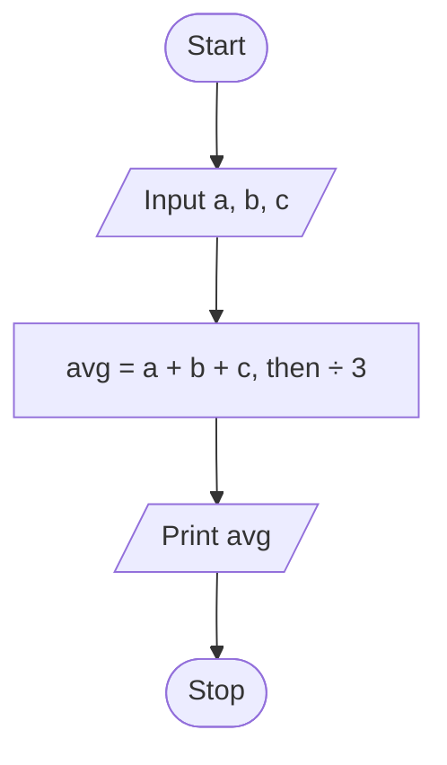
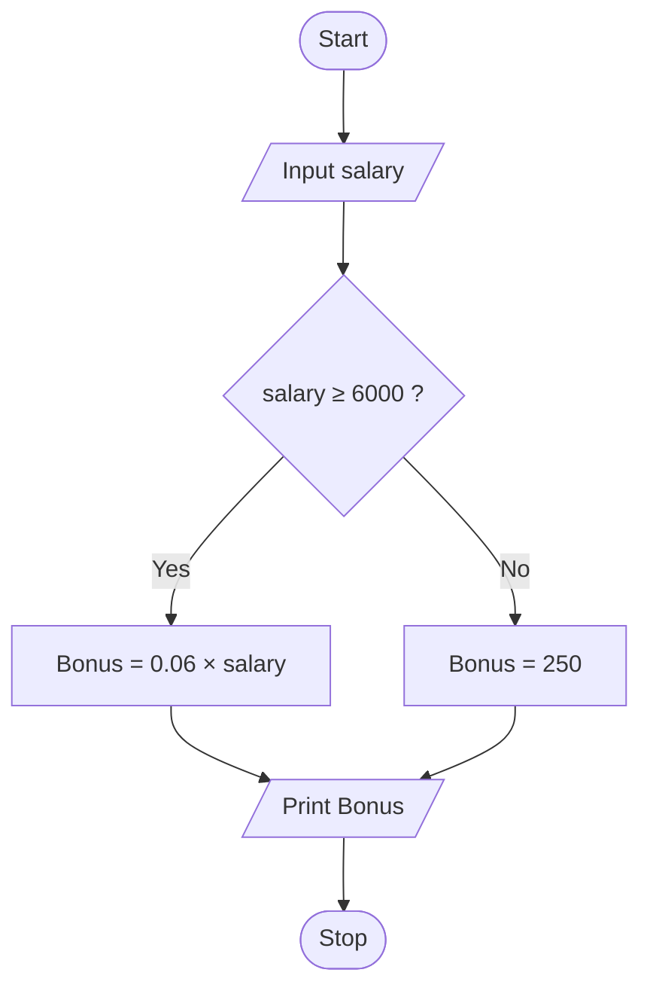
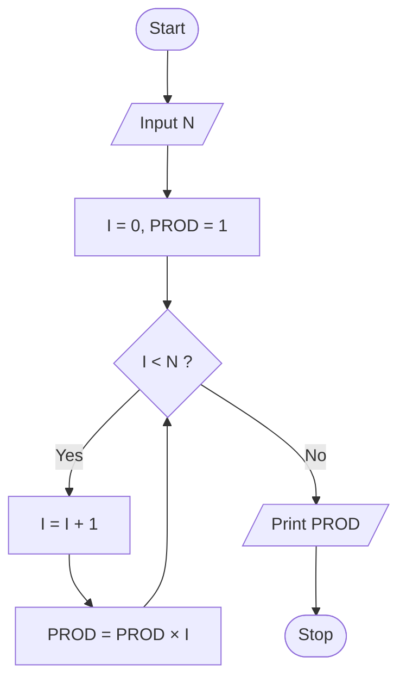

<div class="hero" markdown>
<span class="eyebrow">Lesson 2 of 3</span>
# Flowcharts: drawing the logic before you write it
<p class="lede">A flowchart is the same algorithm, drawn instead of written. Boxes for steps, diamonds for decisions, arrows for order. It is how you *see* a mistake instead of hunting for it.</p>
</div>

## Why bother drawing it?

You have the algorithm in words already. Why draw it again? The lecture gives four honest reasons:

1. **You can check the logic by looking.** A branch that leads nowhere is visible in a drawing and invisible in a paragraph.
2. **It communicates.** Your manager, who does not write Python, can read a flowchart and tell you the business rule is wrong — before you code it.
3. **It breaks a big problem into parts** that connect into a master chart.
4. **It is a permanent record** you can come back to six months later.

!!! sowhat "So what?"
    Fixing a mistake on paper costs you a pencil eraser. Fixing the same mistake after you have written 200 lines of code costs you an afternoon. Fixing it after the program has been paying the wrong bonuses for three months costs the company real money.

## The symbols

Only six shapes, and each one means exactly one thing.

<div class="symgrid">
<div class="sym">
<svg width="90" height="38" viewBox="0 0 96 40" aria-hidden="true"><ellipse cx="48" cy="20" rx="42" ry="15" class="fc-shape"/></svg>
<b>Oval — Terminal</b><span>START or STOP. Every flowchart begins and ends with one.</span>
</div>
<div class="sym">
<svg width="90" height="38" viewBox="0 0 96 40" aria-hidden="true"><polygon points="16,6 94,6 80,34 2,34" class="fc-shape"/></svg>
<b>Parallelogram — Input / Output</b><span>INPUT, READ and PRINT go in here.</span>
</div>
<div class="sym">
<svg width="90" height="38" viewBox="0 0 96 40" aria-hidden="true"><rect x="8" y="6" width="80" height="28" rx="2" class="fc-shape"/></svg>
<b>Rectangle — Process</b><span>Any calculation or assignment, like <code>Sum = Sum + N</code>.</span>
</div>
<div class="sym">
<svg width="90" height="42" viewBox="0 0 96 44" aria-hidden="true"><polygon points="48,4 92,22 48,40 4,22" class="fc-dec"/></svg>
<b>Diamond — Decision</b><span>Asks a question. <strong>Two exits</strong>: Yes/No, or True/False.</span>
</div>
<div class="sym">
<svg width="90" height="38" viewBox="0 0 96 40" aria-hidden="true"><path d="M20,20 L76,20" class="fc-shape" style="fill:none" marker-end="url(#m1-arw)"/><defs><marker id="m1-arw" viewBox="0 0 10 10" refX="9" refY="5" markerWidth="7" markerHeight="7" orient="auto-start-reverse"><path d="M0,0 L10,5 L0,10 z" class="arrowhead"/></marker></defs></svg>
<b>Flow line — Direction</b><span>Every line carries an arrow. No arrow, no meaning.</span>
</div>
<div class="sym">
<svg width="90" height="38" viewBox="0 0 96 40" aria-hidden="true"><circle cx="48" cy="20" r="13" class="fc-shape"/><text x="48" y="20" class="fc-t">1</text></svg>
<b>Circle — Connector</b><span>Joins parts of a chart that don't fit next to each other.</span>
</div>
</div>

The rules, in one breath:

- Boxes are joined by **arrows**, never plain lines.
- A symbol is **entered from the top** and **left from the bottom** — except the diamond, which leaves from the sides.
- The diamond has exactly **two exits**.
- The chart generally flows **top to bottom**.
- It always **ends with a terminal**.

## Structure 1 — Sequence

Here is Lesson 1's average-of-three algorithm, drawn. Follow the arrows from Start to Stop: there is only one road.



## Structure 2 — Decision

Now a real business rule from the lecture:

!!! note "The problem"
    ABC company plans to give a **6% year-end bonus** to each employee earning **EGP 6,000 or more** per month, and a fixed **EGP 250** bonus to the remaining employees. Draw a flowchart for calculating one employee's bonus.

Notice how the diamond splits the road in two — and how both roads **join back together** before the Print box. That joining matters: the printing happens once, whichever branch you took.



Now translate the drawing into Python. The diamond becomes `if`, the two boxes become the two branches:

```runpy
title: The ABC company bonus
sub: the decision flowchart, in code
inputs:
  - 5500
input_hint: one monthly salary in EGP — try 5500, then try 9000
---
salary = float(input("Monthly salary in EGP: "))

if salary >= 6000:
    bonus = 0.06 * salary
else:
    bonus = 250

print("Salary:", salary, "EGP")
print("Bonus :", bonus, "EGP")
```

!!! trap "The boundary trap"
    The rule says **6,000 or more**, so the condition must be `>=` and not `>`. Change it to `>` and run it with a salary of exactly 6000: that employee silently drops from a 360 EGP bonus to 250 EGP. Nothing crashes. No error appears. This is why the person who understands the *business rule* has to check the code — and in this room, that person is you.

## Structure 3 — Loop

The loop is the one structure where an arrow goes **backwards**. That backward arrow is the whole idea: after doing the work, go back and ask the question again.

Here is the factorial flowchart from the lecture.



### Pre-test and post-test loops

Where you put the diamond changes the meaning:

<div class="cols two" markdown>
<div class="card" markdown>
#### Pre-test loop
The question comes **first**. If the answer is No straight away, the work **never happens even once**.

*Checking the fridge before cooking. Nothing inside? You don't cook.*
</div>
<div class="card" markdown>
#### Post-test loop
The question comes **last**. The work happens **at least once**, then you decide whether to repeat.

*Tasting the tea, then deciding whether to add more sugar.*
</div>
</div>

### Adding the integers from 1 to 100 <span class="slidetag">Flowcharts, Ex. 3</span>

Same loop shape, different job. Trace it in your head first: what will `Sum` be after the first three passes?

```runpy
title: Sum of 1 to 100
sub: the loop flowchart, in code
---
Sum = 0
N = 1

while N <= 100:
    Sum = Sum + N
    N = N + 1

print("Sum =", Sum)

# Student B from Lesson 1 would write it in one line.
# Uncomment the next line and compare - same answer, no loop:
# print("Formula =", 100 * 101 / 2)
```

## Pseudocode: the middle step

There is one more tool between the drawing and the program, and the lecture is careful about it: **pseudocode is neither an algorithm nor a program.** It is an *abstract form of a program* — English-like statements that look like code, without obeying any language's exact rules.

| | What it is | Who reads it |
|---|---|---|
| **Algorithm** | A systematic, step-by-step logical procedure in plain English. | Anyone |
| **Pseudocode** | A simpler version of programming code, using short phrases. Syntax is not strictly followed. | You and other programmers |
| **Flowchart** | The same logic drawn with shapes and arrows. | Anyone, especially non-programmers |
| **Program** | Exact code following *all* the rules of the language. | The computer |

### Determining a student's final grade <span class="slidetag">Flowcharts, slides 23–24</span>

The lecture's pseudocode — *not runnable, and that's the point:*

```text
input Mark1, Mark2, Mark3, Mark4
Avg = (Mark1 + Mark2 + Mark3 + Mark4) / 4
if Avg >= 60:
    print "Pass"
else:
    print "Fail"
End if
```

It reads almost like Python — but `print "Pass"` is not legal Python, and `End if` is not a Python word at all. Pseudocode is allowed to be sloppy; a program is not. Here is the legal version:

```runpy
title: Pass or Fail
sub: pseudocode turned into a real program
inputs:
  - 55
  - 70
  - 62
  - 48
input_hint: four marks, one per line
---
Mark1 = float(input("Mark 1: "))
Mark2 = float(input("Mark 2: "))
Mark3 = float(input("Mark 3: "))
Mark4 = float(input("Mark 4: "))

Avg = (Mark1 + Mark2 + Mark3 + Mark4) / 4

if Avg >= 60:
    print("Average", Avg, "- Pass")
else:
    print("Average", Avg, "- Fail")
```

---

Next: [**Intro to Programming**](03-intro-programming.md) — from the drawing to a machine that actually runs it.
