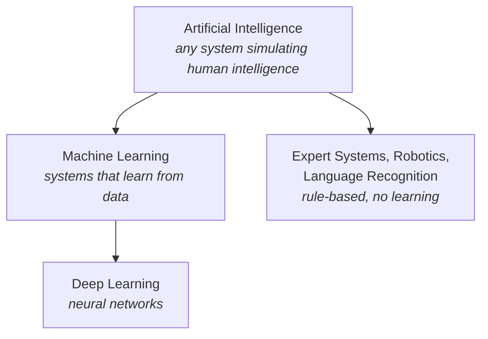

<div class="hero" markdown>
<span class="eyebrow">Lesson 1 of 5 · Lecture 3_1</span>
# What is data science?
<p class="lede">Before the code, the vocabulary. Data science, machine learning, and artificial intelligence get used interchangeably in the news — they are not the same thing, and knowing the difference will save you from a lot of nonsense.</p>
</div>

## Data science

**Data science** is an interdisciplinary field combining three things:

<div class="cols two" markdown>
<div class="card" markdown>
#### Statistics
The methods for measuring, testing, and quantifying uncertainty.
</div>
<div class="card" markdown>
#### Computer science
The tools to store, process, and compute at scale.
</div>
<div class="card" markdown>
#### Domain expertise
Knowing what the numbers *mean* — economics, politics, sociology. **This is the part you bring.**
</div>
<div class="card" markdown>
#### The goal
Analyse structured and unstructured data to uncover patterns, extract insights, and support real decisions.
</div>
</div>

### The four objectives

1. **Data preparation** — restructure, clean, and organise data for analysis.
2. **Data visualisation and communication** — present findings through visuals and clear narrative.
3. **Advanced analytics** — apply machine learning to discover patterns and build predictive models.
4. **Ethical considerations** — understand the social implications of collecting and using data.

!!! sowhat "Why objective 4 is on the list"
    A model that predicts which loan applicants will default is also a model that can quietly encode historical discrimination, because it learns from decisions humans already made. As social scientists, you are better equipped than most programmers to spot that. Treat the ethics as part of the analysis, not an afterthought bolted on at the end.

## Data science versus statistics

<p style="font-family:var(--serif); font-size:1.3rem; text-align:center; margin:1.5rem 0; color:var(--crimson)">
In statistics, "the model is the king."<br>In data science, "the data is the king."
</p>

| | Statistics | Data science |
|---|---|---|
| **Driven by** | the model | the data |
| **Approach** | assume a mathematical model, then test whether the data fits | let the data reveal patterns, without a predefined model |
| **Main goal** | explain phenomena, measure uncertainty, draw reliable conclusions | predict what will happen, automate, solve at scale |
| **Answers** | **why** is this happening? | **what** will happen next? |
| **Strength** | rigour and interpretability | handling vast, diverse, messy data |

Neither is better. They answer different questions, and a good analyst knows which question they're being asked.

## Machine learning

**Machine learning** is a branch of AI that lets computers learn from data and make predictions **without being explicitly programmed** with the rules.

In Module 1 you saw that there are many different algorithms just to sort a list. Machine learning is the same idea: many different algorithms — regression, decision trees, neural networks — each suited to a particular kind of problem.

!!! life "Learning a pattern, not a rule"
    A telecoms company wants to know which customers will cancel their service (*churn*). Nobody writes the rule `if bill > 500 and usage < 20: will_leave = True`. Instead the algorithm reads thousands of historical customers and **discovers** that "high bill + low usage" tends to precede cancellation.

    That relationship — "high bill + low usage → likely to leave" — is what's meant by a **pattern**: a reliable relationship between variables. The model then applies it to a *new* customer it has never seen.

## AI, ML, and data science: the nesting



The key relationships:

- **All machine learning is AI, but not all AI is machine learning.** An older expert system that makes decisions from a pre-written set of IF/THEN rules is AI — it just doesn't learn.
- **Data science** overlaps all of this but isn't inside it: it also covers cleaning, visualising, and communicating, none of which are AI.

??? question "Six questions from the lecture — try before you read on"
    **1. Which three fields form the interdisciplinary foundation of data science?**
    Statistics, computer science, and domain expertise.

    **2. What is the primary focus of traditional statistics compared with data science?**
    Inference, and explaining relationships within data.

    **3. What is the relationship between AI and ML?**
    ML is a subset of AI.

    **4. What does "pattern" mean in machine learning?**
    A reliable statistical relationship between different variables — not a single data point, and not a rule the programmer wrote.

    **5. Which data science objective covers applying ML algorithms to forecast outcomes?**
    Advanced analytics.

    **6. "Data science is data-driven" means what?**
    Letting the data reveal patterns, rather than starting with a predefined model.

## The libraries

The Python community has built an enormous toolbox. For a data scientist, five names matter most:

| Library | What it does |
|---|---|
| **NumPy** | the cornerstone of scientific computing — fast multidimensional arrays and linear algebra. Most other tools are built on it. |
| **pandas** | high-performance data structures and analysis tools. *"Like a programmatic Excel sheet."* |
| **Matplotlib** | the foundational plotting library. Total control, somewhat verbose. |
| **Seaborn** | built on Matplotlib, designed for statistics. Beautiful defaults, less typing. |
| **scikit-learn** | machine learning — classification, regression, clustering, model selection. |

The lecture's claim, which is fair: **95% of all analyses can be run start to finish with these.**

## Pandas

- Open-source, high-performance, easy-to-use tool for analysing **tabular** data.
- Created by **Wes McKinney in 2008**, for financial data analysis at AQR Capital Management.
- The name comes from **"Panel Data"** — an econometrics term you'll recognise.
- Its key feature is the **DataFrame**: a fast, flexible object that makes manipulating data intuitive.
- It reads and writes CSV, text, Excel, and SQL, and plugs straight into Matplotlib for charts.

The convention, which you should follow:

```runpy
title: Meet pandas
sub: your first import
packages: [pandas]
---
import pandas as pd

print("pandas version:", pd.__version__)
print()

# A DataFrame is a table: rows, columns, and cells
df = pd.DataFrame({
    "Math":    [90, 85, 78],
    "Science": [88, 92, 80]
}, index=["Ali", "Mona", "Sara"])

print(df)
```

!!! life "Read that output carefully"
    - **Rows** are individual records — here, three students.
    - **Columns** are variables or features — here, Math and Science.
    - **Cells** are the actual values — Ali scored 90 in Math.

    A DataFrame is essentially a dictionary of columns, with a great deal of extra machinery bolted on: indexing, slicing, aggregation, plotting, merging, and handling missing data. All the things you'd otherwise write loops for.

---

Next: [**Pandas basics**](02-pandas-basics.md) — building and inspecting a DataFrame.
