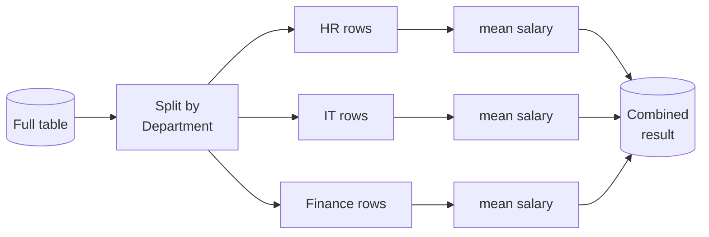

<div class="hero" markdown>
<span class="eyebrow">Lesson 3 of 5 · Lecture 3_1</span>
# Summarising, grouping, and filtering
<p class="lede">You have the table. Now make it answer questions: what does this data look like, how do the groups differ, and which rows actually matter?</p>
</div>

## Summary statistics

```runpy
title: The basic aggregations
sub: count, sum, mean
packages: [pandas]
---
import pandas as pd

df = pd.DataFrame({
    "GDP":        [119, 206, 240, 94],
    "median_age": [42, 47, 52, 45],
    "population": [65, 60, 83, 46],
    "pop_gr":     [0.20, -0.15, 0.20, 0.04]
}, index=['France', 'Italy', 'Germany', 'Spain'])

print(df)
print("\n--- count of rows per column ---")
print(df.count())
print("\n--- mean of each column ---")
print(df.mean())
print("\n--- the mean of one column only ---")
print("GDP mean:", df["GDP"].mean())
```

```runpy
title: agg() — several statistics at once
sub: the result is itself a DataFrame
packages: [pandas]
---
import pandas as pd

df = pd.DataFrame({
    "GDP":        [119, 206, 240, 94],
    "median_age": [42, 47, 52, 45],
    "population": [65, 60, 83, 46],
    "pop_gr":     [0.20, -0.15, 0.20, 0.04]
}, index=['France', 'Italy', 'Germany', 'Spain'])

vstat = df.agg(['mean', 'median', 'std'])
print(vstat)

print("\n--- just the GDP column of that result ---")
print(vstat['GDP'])
```

### describe()

The one command that gives you a first picture of any dataset.

For a **numerical** column you get eight statistics: `count`, `mean`, `std`, `min`, `25%`, `50%` (the median), `75%`, `max`.

For a **categorical** column you get four: `count`, `unique`, `top` (the most common value), `freq` (how often it occurs).

```runpy
title: describe()
sub: eight numbers that tell you a lot
packages: [pandas]
---
import pandas as pd

df = pd.DataFrame({
    "GDP":        [119, 206, 240, 94],
    "median_age": [42, 47, 52, 45],
    "population": [65, 60, 83, 46],
    "pop_gr":     [0.20, -0.15, 0.20, 0.04]
}, index=['France', 'Italy', 'Germany', 'Spain'])

print(df.describe().round(2))
```

!!! sowhat "Read describe() like a checklist"
    - Is `count` the same for every column? If not, you have **missing data**.
    - Is `min` or `max` impossible? A negative age, a 300-year-old, a fare of zero — that's a **data quality problem**, not a finding.
    - Is `mean` far from the `50%` median? Then the distribution is **skewed**, and the mean is a poor summary. Income data does this almost always.

    Three seconds of reading here saves you from an analysis built on broken data.

### Correlation

```runpy
title: The correlation matrix
sub: which variables move together
packages: [pandas]
---
import pandas as pd

df = pd.DataFrame({
    "GDP":        [119, 206, 240, 94],
    "median_age": [42, 47, 52, 45],
    "population": [65, 60, 83, 46],
    "pop_gr":     [0.20, -0.15, 0.20, 0.04]
}, index=['France', 'Italy', 'Germany', 'Spain'])

print(df.corr().round(2))

print("\n--- correlation of everything with GDP ---")
print(df.corr()['GDP'].round(2))

print("\n--- one specific pair ---")
print("GDP vs population:", round(df.corr()['GDP']['population'], 2))
```

!!! trap "Correlation is not causation, and four points is not evidence"
    A correlation of 0.78 between GDP and population across **four** countries tells you almost nothing — with that few observations, strong-looking correlations appear by chance constantly. And even with 4,000 countries, correlation would tell you the two move together, never that one *causes* the other. You are social scientists; you already know this. The danger is that pandas makes computing it so easy that you stop asking.

## Missing data

Every real dataset has holes. pandas marks them `NaN` ("not a number").

```runpy
title: Finding and handling missing values
sub: isna, dropna, and the subset argument
packages: [pandas]
---
import pandas as pd

data = pd.DataFrame({"A": [1, 2.1, None, 4.7, 5.6, 6.8],
                     "B": [.25, None, None, 4, 12.2, 14.4]})
print(data)

print("\n--- isna() : True where a value is missing ---")
print(data.isna())

print("\n--- isna().sum() : how many missing per column ---")
print(data.isna().sum())

print("\n--- dropna() : remove any row with a missing value ---")
print(data.dropna())

print("\n--- but the original is unchanged ---")
print(data)

print("\n--- dropna(subset=['A']) : only care about missing A ---")
print(data.dropna(subset=['A']))

print("\n--- dropna(axis=1) : drop the COLUMNS that have gaps ---")
print(data.dropna(axis=1))
```

!!! sowhat "Deleting rows is a decision, not a cleanup step"
    `dropna()` is one word and it can silently throw away a third of your data. Worse, the rows with missing values are often **not random** — people who decline to state their income are systematically different from those who answer. Drop them and your conclusions apply to a population that doesn't exist.

    Always print `isna().sum()` first, and always report how many rows you removed and why.

## groupby()

The single most powerful thing in pandas. It follows a strategy called **split – apply – combine**:

1. **Split** the data into groups based on a column's values.
2. **Apply** a function to each group (`mean()`, `sum()`, `count()`, `size()`…).
3. **Combine** the results back into one table.



```runpy
title: groupby, the simple version
sub: split, apply, combine
packages: [pandas]
---
import pandas as pd

df = pd.DataFrame({'key': ['A', 'B', 'C', 'A', 'B', 'C'],
                   'data': range(6)})
print(df)

x = df.groupby('key')

print("\n--- size(): how many rows in each group ---")
print(x.size())

print("\n--- sum of each group ---")
print(x.sum())

print("\n--- agg(): two functions at once ---")
print(df.groupby('key')['data'].agg(['sum', 'count']))
```

### The employee example

```runpy
title: Five questions, five groupbys
sub: the lecture's employee dataset
packages: [pandas]
---
import pandas as pd

data = {
    'Department': ['HR','HR','HR','HR','IT','IT','IT','IT',
                   'Finance','Finance','Finance','Finance'],
    'Employee': ['Alice','Bob','Carol','Dan','Eve','Frank',
                 'Grace','Heidi','Ivan','Judy','Karl','Laura'],
    'Salary': [50000,52000,51000,53000,60000,61000,
               61000,63000,70000,71000,70000,72000],
    'HoursWorked': [160,155,162,158,170,165,168,172,150,155,160,165],
    'Year': [2023,2023,2024,2024,2023,2023,2024,2024,2023,2023,2024,2024]
}
df = pd.DataFrame(data)

print("1. Average salary per department:")
print(df.groupby('Department')['Salary'].mean())

print("\n2. Average salary per department per year:")
print(df.groupby(['Department', 'Year'])['Salary'].mean().unstack())

print("\n3. Mean and std of salaries by department and year:")
print(df.groupby(['Department', 'Year'])['Salary'].agg(['mean', 'std']).unstack())

print("\n5. Number of employees per department per year:")
print(df.groupby(['Department', 'Year']).size().unstack())
```

!!! life "What `unstack()` does"
    Grouping by two columns gives you a result with two levels of index stacked vertically — readable, but long and thin. `unstack()` takes the inner level and turns it into **columns**, so you get a proper cross-tab: departments down the side, years across the top. Much easier to read, and exactly the shape you'd want in a report.

## Filtering

Selecting the subset of rows that meet a condition. Two ways, both valid:

- **Boolean indexing** — write the condition in square brackets: `df[df['Country'] != 'UK']`
- **`.query()`** — write it as a readable, SQL-like string: `df.query("Country != 'UK'")`

```runpy
title: Two ways to filter
sub: boolean indexing and query()
packages: [pandas]
---
import pandas as pd

f = ['Names', 'Country', 'City']
d = [['Mohammed', 'Egypt', 'Banha'],
     ['Ann', 'UK', 'London'],
     ['John', 'Sweden', 'Stockholm']]
df = pd.DataFrame(d, columns=f)

print("--- the condition itself is a column of True/False ---")
print(df['Country'] == 'UK')

print("\n--- boolean indexing: keep the True rows ---")
print(df[df['Country'] == 'UK'])

print("\n--- query(): the same thing, more readable ---")
print(df.query("Country == 'UK'"))

print("\n--- not London ---")
print(df[df['City'] != 'London'])

print("\n--- combining conditions: & is and, | is or ---")
print(df[(df['Country'] != 'UK') & (df['City'] != 'Banha')])
```

!!! trap "Use `&` and `|`, not `and` and `or`"
    When filtering a DataFrame you are combining whole **columns** of True/False, not two single values, so pandas needs the element-wise operators `&` and `|`. And each condition must be wrapped in its own parentheses — `(a) & (b)` — because `&` binds more tightly than `==`. Get it wrong and you'll see `ValueError: The truth value of a Series is ambiguous`, which is pandas telling you exactly this.

## Reading and writing CSV files

A CSV ("comma-separated values") file is the universal format for tabular data. One line per row, commas between the values.

```python
import pandas as pd

df = pd.read_csv("weight-height.csv")     # read it
print(df.shape)                            # (10000, 3)
df.info()
print(df.head())

# ... do your analysis ...

df.describe().round(2).to_csv("summary.csv")    # write CSV
df.describe().round(2).to_excel("summary.xlsx") # or Excel
```

!!! trap "Reading files in this browser"
    `pd.read_csv("somefile.csv")` needs a file on your computer's disk, which a web page can't reach. In the cells on this site we use Pyodide's `open_url()` to fetch the file over the web instead — one extra line. **In Jupyter, Colab, or Spyder you use plain `pd.read_csv()` as shown above.**

Here's a real CSV being read, using the dataset for the next lesson's case study:

```runpy
title: Reading a real CSV file
sub: 891 rows of real data
packages: [pandas]
---
import pandas as pd
from pyodide.http import open_url        # browser-only: fetch over the web

# On your own computer this single line would be:
#     df = pd.read_csv("titanic.csv")
df = pd.read_csv(open_url(DATA_URL + "titanic.csv"))

print("Shape:", df.shape)
print()
df.info()
print()
print(df.head())
```

### value_counts()

For a categorical column, this is the one you'll reach for constantly:

```runpy
title: value_counts()
sub: how many of each category
packages: [pandas]
---
import pandas as pd
from pyodide.http import open_url

df = pd.read_csv(open_url(DATA_URL + "titanic.csv"))

print("--- passengers by sex ---")
print(df['sex'].value_counts())

print("\n--- passengers by class ---")
print(df['pclass'].value_counts().sort_index())

print("\n--- as proportions instead of counts ---")
print(df['sex'].value_counts(normalize=True).round(3))

print("\n--- and a groupby on real data ---")
print(df.groupby('sex')[['age', 'fare']].mean().round(2))
```

---

Next: [**Visualisation**](04-visualization.md) — turning these tables into pictures.
